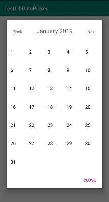

# Custom Date Picker


* tampilan dialog date picker : 





* tambahkan kedalam app.gradle :

```
	dependencies {
		...
		implementation 'com.github.renosyah:CustomDatePicker:0.6'
	
	}

```


* cara pakai : 

```
CustomDatePicker dialog = new CustomDatePicker(this);
        dialog.setOnDateChooseListener(new CustomDatePicker.OnDateChooseListener() {
            @Override
            public void ChoosedDate(int day, int month, int year) {
                
		// letakkan kode anda disini

            }
        });
        dialog.OpenDialog();

```
